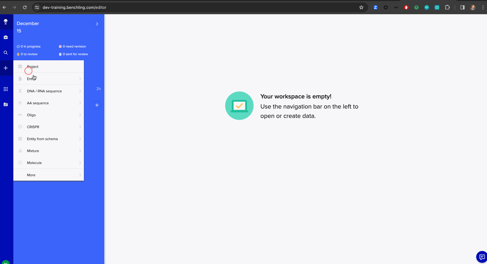
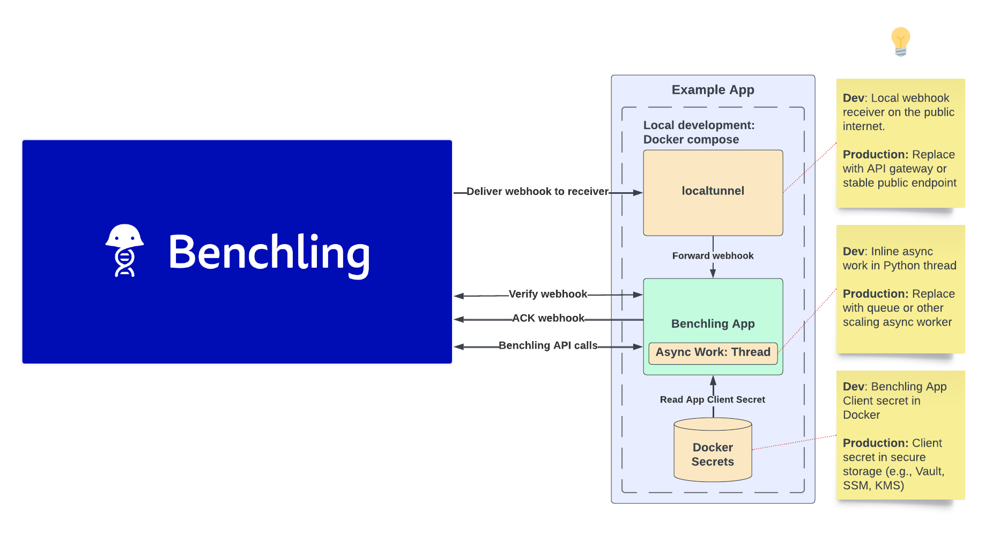

# App Workshop - Chemical Sync for Local Development

In this workshop, we'll build an example Benchling App written in Python which allows users to search for chemicals 
via [PubChem](https://pubchem.ncbi.nlm.nih.gov/) and create them in Benchling. Check out the [Architecture Diagram](#architecture-diagram) for a more technical overview of how the app is structured to communicate with Benchling.


_The App features branching flows and will also validate user inputs._

This app is optimized as a minimal local development experience using [Docker](https://www.docker.com/) for reproducibility.

> ⚠️ **Development Only**: This example is not meant to be copied into production as-is. There are additional deployment, scale, and security concerns that should be addressed before deploying an app based on this example to production.

It relies on a few other tools that will be installed for you within Docker containers:
* [Cloudflare-tunnel](https://www.cloudflare.com/products/tunnel/) - expose a public webhook URL and forward the results locally. ⚠️ *Not for production or real data!*
* [Flask](https://flask.palletsprojects.com/) - A simple Python web application framework

## Table of contents

For each participant, we've already done several of the steps under **"Setting up the app in Benchling"** prior to today's workshop in order to facilitate the group and get into the actual app-building as smoothly as possible. These steps have been marked by the check emoji ✅. We'll still talk through these steps live in the workshop, but there shouldn't be any work needed for them today.

1. [Prerequisites](#prerequisites)
2. [Environment setup](#environment-setup)
3. [IDE setup](#ide-setup)
4. [Architecture diagram](#architecture-diagram)
6. [Setting up the app in Benchling](#setting-up-the-app-in-benchling)
    1. [Log in to the tenant](#log-in-to-the-tenant)
    2. [Upload the app manifest](#upload-the-app-manifest) ✅
    3. [Update the webhook URL](#update-the-webhook-url) 
    4. [Generate a client secret](#generate-a-client-secret)
    5. [Set the client ID](#set-the-client-id)
    6. [Set the app definition ID](#set-the-app-definition-id)
    7. [Install the app on the tenant](#install-the-app-on-the-tenant) ✅
    8. [Create Benchling dependencies for the app](#create-benchling-dependencies-for-the-app) ✅
    9. [Update the app's configuration](#update-the-apps-configuration)
    10. [Permission the app](#permission-the-app) ✅
7. [Receiving our first webook](#receiving-our-first-webhook)
8. [Rebuilding the app](#rebuilding-the-app)
9. [Running the app](#running-the-app---syncing-a-chemical)
10. [Appendix: useful workshop commands](#appendix-useful-workshop-commands)


## Prerequisites

For this workshop, we'll need the following tools to be installed and configured on your machine. We'll also be making use of your machine's command prompt to set up and run our app.

1. [Docker Desktop](https://www.docker.com/products/docker-desktop/)
    1. Example test: `docker run --rm -it python:3.11 bash`
1. [Git](https://github.com/git-guides/install-git)
    1. Example test: `git clone git@github.com:benchling/app-examples-python.git`
1. A Python IDE
    1. For the workshop, **we recommend [VSCode](https://code.visualstudio.com/Download) with the [Dev Containers](https://marketplace.visualstudio.com/items?itemName=ms-vscode-remote.remote-containers) plugin installed if you don’t have an IDE preference**
    1. [PyCharm](https://www.jetbrains.com/pycharm/download/) users may have success with its [partial support for Dev Containers](https://www.jetbrains.com/help/pycharm/connect-to-devcontainer.html#create_dev_container_inside_ide)
    1. If you’d like to bring your own IDE, we ask that you come prepared to:
        1. Setup your own Python virtual environment for **Python 3.11** 
        1. Install requirements on your own (e.g., `pip install -r requirements.txt`)
1. Ensure that you have no other processes already running on **port 8000**.

## Environment setup

1. Clone the repository: `git clone git@github.com:benchling/app-examples-python.git`
    1. If you don't have git setup with SSH, you may receive an error. You can clone via HTTPS instead: `git clone https://github.com/benchling/app-examples-python.git`
1. Checkout the workshop branch: `git checkout benchtalk-workshop`
    1. Pull the latest if you previously checked out: `git pull`
1. Navigate to the example directory for **chem-sync-local-flask**:
    1. `cd app-examples-python/examples/chem-sync-local-flask/`
1. Create `.client_secret` and `.env` placeholder files that we'll use to hold our app's client secret
    1. *nix: 
        - `touch .client_secret`
        - `touch .env`
    1. Windows: 
        - `echo.> .client_secret`
        - `echo.> .env`
1. Start building the Docker containers
`docker compose up --build -d`
1. Optionally start the Docker logs `docker compose logs -f` in a separate terminal window

### Notes on Docker for Windows

- Some Windows machines may require extra configuration when running Docker. If you’re not able to run `docker-compose up –build` successfully on the example Git repository, you may need to configure Docker to “Use ContainerD for pulling and storing images" in `Docker > Settings > Features in development > Beta Features`.
- If you encounter an error running any Docker commands that looks like `ERROR: request returned Bad Gateway for API route and version`, following these instructions may help: https://github.com/docker/for-mac/issues/6956#issuecomment-1876444658

## IDE setup

In **VSCode**:
1. `File > Open Folder > app-examples-python/examples/chem-sync-local-flask/`
    1. It's important to open the `chem-sync-local-flask` folder, _not_ the root `app-examples-python` folder
1. Click **Reopen in Container** when prompted (you can also do this from the lower left corner menu)
1. You may need to click **Reload Window** to finish loading extensions. This is normal.

In PyCharm:
1. `File > Open > app-examples-python/examples/chem-sync-local-flask/`
1. Open the file `.devcontainer/devcontainer.json`
1. In the left tray, click the container icon and select **Create Dev Container and Mount Sources**
1. Accept the defaults, click **Build Container and Continue**

Any other IDE:
1. In `app-examples-python/examples/chem-sync-local-flask/`
1. Create a **Python 3.11** virtual environment, activate it, and install requirements (e.g., `pip install -r requirements.txt`)

### Check Existing Docker Setup
1. Once Docker has finished building and composing up:
`curl localhost:8000/health`

## Architecture diagram

### What's running on my computer?



## 🛑 Stop here! We will proceed live in the workshop 🚀
Feel free to read through some of the document if you want to sneak preview some of the workshop content, but please don't do any work in the tenant. We've created some data for each participant already, and want to avoid duplicate data in the tenant!

## Setting up the app in Benchling

### Log in to the tenant

Navigate to https://benchling-app-workshops.benchling.com/ and log in. 

**Email**: The email that you used to sign up for Benchtalk / this workshop

**Passsword**: benchtalk2024

### Upload the app manifest

Open `manifest.yaml` and rename the App's `name` attribute under `info` by suffixing your name to the end.

Example: `Sample Sync App` -> `Sample Sync App - FirstName LastName`

Click the user icon in the bottom left corner to bring up the main menu. Select "Feature Settings" > "Developer Console"

Next, click the "Create app" button and choose "From manifest."

When prompted to upload a file, select `manifest.yaml` and click "Create."


### Update the webhook URL

Every time we restart the `cloudflare-tunnel` Docker container, it will provision
a new public webhook URL. We can check logs with `docker compose logs cloudflare-tunnel` to retrieve it:

```
  Your quick Tunnel has been created! Visit it at (it may take some time to be reachable): 
  https://processor-identifies-botswana-messaging.trycloudflare.com
```

On *nix systems, you can easily obtain _just_ the URL via:

```
docker compose logs cloudflare-tunnel | grep -o 'https://[^ ]*trycloudflare.com[^ ]*' | tail -n 1
```

Example Output:

```
https://processor-identifies-botswana-messaging.trycloudflare.com
```

Update the Benchling App's Webhook URL in the UI with the new server and
append the path our Flask route expects (see `local_app/app.py`).


### Generate a Client Secret

Generate a client secret in Benchling and be sure to copy the secret.


Since the client secret is sensitive, it's handled a bit differently. It's
registered as a `secret` in our `docker-compose.yaml` file, which will be looking
for a file `./client_secret`, which we should have already created.

If the file has not yet been created, you can create it from a terminal as follows, or just create the file from within your IDE.
```bash
# On *nix systems
touch .client_secret

# On Windows
echo.> .client_secret
```

Then, paste in the secret plaintext value. If we have the secret in our clipboard, on *nix:

```bash
pbpaste > .client_secret
```

> ⚠️ **Security Note:** Be sure to avoid committing `.client_secret` to a source code repository.


### Set the Client ID

Our App needs a Client ID to pair with the Client Secret for authentication to Benchling. In this case, we've created our 
App to accept `CLIENT_ID` as an environment variable.

One easy way to set an environment variables for Docker is to add a `.env` file, which we should have already created.

If the file has not yet been created, you can again create it from a terminal as follows, or just create the file from within your IDE.
```bash
# On *nix systems
touch .env

# On Windows
echo.> .env
```

Open it in an editor of your choice and set the values with the plaintext client ID 
for your App. For example:

```
CLIENT_ID=Ts7jtwPohM
```


> ⚠️ **Security Note:** In production, store the secret with a secure solution such as a secrets store (AWS Secrets Manager, as an example) or, if storing programmatically, encrypted using app-layer encryption. Avoid placing it in plaintext anywhere in code or configuration.

### Set the App Definition ID

The App definition ID is available from the app's overview tab in the Developer Console.


Add it to your `.env` file with a variable name `APP_DEFINITION_ID`. The contents of your `.env` file should now look something like:

```
CLIENT_ID=Ts7jtwPohM
APP_DEFINITION_ID=appdef_Trow4zbR3o
```

You'll then need to restart _just_ the `benchling-app` Docker service to pick up the changes to both `.env` and `.client_secret`:

```bash
docker-compose up -d
```

If you restart both containers, be sure to update your App in Benchling with the new webhook URL from `cloudflare-tunnel`.

### Install the App on the tenant

In order to use our new app on the tenant, we'll first have to install it. Navigate to the `Version History` tab on the developer console, and click `Install` on our app version (there should only be a single version for now).


### Create Benchling Dependencies for the App

If you examine the `configuration` section of `manifest.yaml`, you'll see our App
expects a few configuration items:
1. A folder
2. A molecule entity schema with two decimal fields

The `features` section of `manifest.yaml` also states that our App will render
its UI on an `ASSAY_RUN`. So we'll also need:
1. A Lab Automation run schema

#### Folder

We'll need a folder in which to place the molecules created by the app. For this workshop, we've created a folder that you can use called `Sync Molecules` inside the `Build-an-App workshop` project. If you want to create and use your own folder, that's fine too!


#### Molecule Entity Schema

For this workshop, we've already created a sample entity schema that all participants can use, `Molecule Schema for Syncing`. No new entity schema will need to be created.

#### Lab Automation Run Schema

Because Assay Run objects will host the Canvas UI created by the App, each workshop participant needs their own unique lab automation run schema to pair with their app. For this workshop, we've already created a run schema for each participant, where the name of the schema will follow the format `[Participant name] - Sync Molecule`. No fields are required on this schema.

### Update the App's Configuration

App Configuration gives us a stable code contract for referencing data mapped in a Benchling tenant.
The values of the data in Benchling can then be changed without updating app code.

Now that we have the necessary Benchling objects from previous steps, let's update our configuration to:
1. Specify the folder for syncing sequences
2. Link the `Molecule Schema for Syncing` entity schema and fields for the synced chemicals
3. Select our assay run schema to associate with our Benchling app

### Permission the App

By default, Benchling apps do not have permission to any data in Benchling.

Your presenter will show how the apps have been permissioned by adding them to an organization prior to the workshop. 

## Receiving our First Webhook

Let's test our app's ability to receive webhooks! To do this, we can use the `Webhook Testing` tab in the Developer Console. On this page, we can select any available webhook type to test out and send to our app's webhook URL - try it out! In general, this page is a great way to quickly imitate Benchling sending any type of webhook to your app in development.


Observe our debug logging printing webhooks that our app receives. (If you don't have the logs running already, you can run `docker compose logs -f`.)

For now, from observing the code, our app will simply return a `200 OK` response without doing any work. Over the course of this workshop, we'll build up our app to execute more complex logic in response to webhooks, in order to provide an interactive canvas-based UX for our end users.

## Rebuilding the App
Now, we'll rebuild the app piece by piece together! Your workshop presenter will talk through slides outlining this process, and then show the code changes live. We've also included an outline below as a reference.

### 1. Set up our app with credentials and handle our first real canvas webhook
💡 After completing step 1, you should be able to create an assay run (of your app's specific run schema) in a notebook entry, and have a basic "Hello world!" canvas show up.
```
local_app/app.py
- Verify webhook
- Enqueue work, targeting function handle_webhook

local_app/benchling_app/handler.py
- Examine handler function handle_webhook
- Click into init_app_from_webhook

local_app/benchling_app/setup.py
- Finish implementing init_app_from_webhook
- _auth_method
- _client_secret_from_file

local_app/benchling_app/handler.py
- Observe the way we handle canvas initialization webhooks
- Click into render_search_canvas

local_app/benchling_app/views/canvas_initialize.py
- Observe how to initialize a canvas in render_search_canvas
```

### 2. Handle Canvas initialization, learn about and use App Sessions
💡 After completing step 2, initializing the canvas via assay run should show the initial chemical search UI. Additionally, app activity will begin to be recorded under the "Activity" tab of the app's installation page.

```
local_app/benchling_app/views/canvas_initialize.py
- In render_search_canvas, replace the basic Hello World canvas logic with the initial sync search screen
- Learn about the create_session_context context manager
```

### 3. Handle user interactions and create a responsive user experience
💡 After completing step 3, you should have a fully functional canvas-based app experience built out that will enable the user to sync chemicals from PubChem into Benchling.
```
local_app/benchling_app/handler.py
- Modify handle_webhook to properly handle interaction webhooks
- Click through to route_interaction_webhook 

local_app/benchling_app/canvas_interaction.py
- Modify the conditional block to handle SEARCH_BUTTON_ID
- Observe the session and canvas builder creation
- Observe the way user inputs are retrieved from the canvas and sanitized
- Click into the search function

local_app/lib/pub_chem.py
- Observe how we use PubChem's search API to retrieve the chemical

local_app/benchling_app/views/chemical_preview.py
- Click through from route_interaction_webhook to render_preview_canvas
- First handle displaying results
- Then handle the case where there are no results
```
At this point, let's check in with our app's behavior in the UI.
- If we type in an invalid search string, we should see an error communicated back to us from the app
- We should be able to type in a chemical and have the canvas successfully show it
- If we press cancel, note that the canvas become stuck because we don't properly handle this button yet
```
local_app/benchling_app/canvas_interaction.py
- Handle the else case for catching unsupported button types

local_app/benchling_app/canvas_interaction.py
- Handle the CANCEL_BUTTON_ID case

local_app/benchling_app/canvas_interaction.py
- Our last button - handle the CREATE_BUTTON_ID case
- Inspect _create_molecule_from_canvas
- Click into create_molecule

local_app/benchling_app/molecules.py
- Modify create_molecule to create the selected molecule in Benchling using the app's selected configuration (folder, molecule schema and fields)

local_app/benchling_app/views/completed.py
- Finally, finish implementing render_completed_canvas to show the final canvas success screen
```

## Running the App - Syncing a Chemical

Once the app has been fully rebuilt, here's how to use it:

1. Create a new notebook entry
2. Insert a run of the schema linked in App Config
3. Create the Run
4. Enter a valid chemical name to search for, such as `acetaminophen`
5. Click "Search Chemicals"
6. After reviewing the preview, click "Create Molecule"
7. Click the linked entity to view it in Benchling


## Appendix: Useful workshop commands

### Toggle Commented Code Blocks

VSCode and PyCharm:
* *nix: `Command + /`
* Windows: `Ctrl + /`

### Docker Commands

#### Tail Logs

```
docker compose logs -f
```

#### Restart individual service (e.g., cloudflare-tunnel)

```
docker compose restart cloudflare-tunnel
```

#### Check Running Services

```
docker compose ps
```
