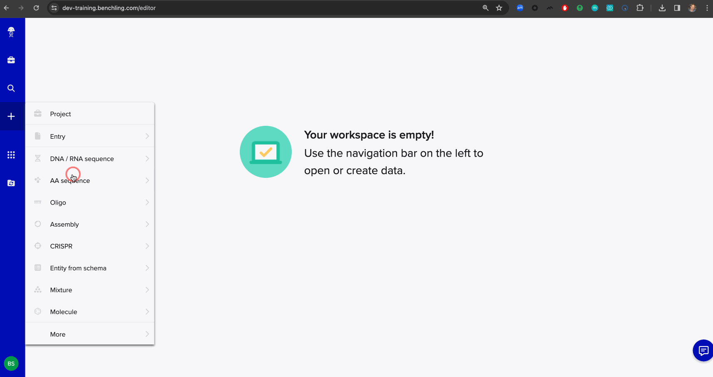
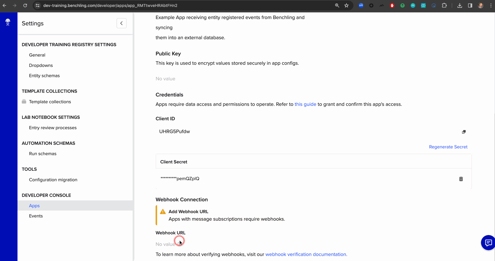

# Benchling App Example: Entity Registered Event Webhook Data Sync

An example Benchling App written in Python which demonstrates receiving a `v2.entity.registered`
event from Benchling via a webhook subscription. The data is retrieved from the API and written
to an external database.



> ℹ️ Events delivered by webhooks is in early access and unavailable by default. To use this example, please reach out to Benchling support to enable webhook delivery for events on your tenant.

**Appendices**:
* [Architecture Diagram](#architecture-diagram)

## Technical Prerequisites

This app is optimized as a minimal local development experience using [Docker](https://www.docker.com/) for reproducibility.

> ⚠️ **Development Only**: This example is not meant to be copied into production as-is. There are additional deployment, scale, and security concerns that should be addressed before deploying an app based on this example to production.

> ⚠️ **Scale Note**: This App responds to a single `v2.entity.registered` event. For high throughput, bulk use cases this can easily result in thousands of events delivered simultaneously. Systems will need to take volume into account and ensure that the App is throttling or batching calls appropriately (e.g., via a queue) to avoid overwhelming rate limits.

It relies on a few other tools that will be installed for you within Docker containers:
* [Localtunnel](https://localtunnel.me/) - expose a public webhook URL and forward the results locally. ⚠️ *Not for production or real data!*
* [Flask](https://flask.palletsprojects.com/) - A simple Python web application framework
* [PostgreSQL](https://www.postgresql.org/) - A free, open source database representing an external data store example

## Getting Started

Create an empty placeholder file for Docker secrets. *nix example:

```bash
touch .client_secret
touch .database_password
```

Windows example:

```cmd
echo.> .client_secret
echo.> .database_password
```

A database password can be created now. It can be any valid PostgreSQL password. Generate and store a secure password in `.database_password`. For local development, you could open the file and manually enter any valid password.

In production, be sure to generate and store passwords securely. Do not use this file for storing passwords.

> ⚠️ **Security Note:** Be sure to avoid committing `.database_password` to a source code repository.

Start Docker:

```bash
docker compose up --build -d
```

Tip: You can omit the `-d` option if you want to run in the foreground. Otherwise, use `docker compose logs -f` to tail logs.

> ℹ️ **Windows Note 1:** "Use ContainerD for pulling and storing images" may need to be enabled in `Docker > Settings > Features in development > Beta Features`

> ℹ️ **Windows Note 2**: If running into an error like "ERROR: request returned Bad Gateway for API route and version", [this solution](https://github.com/docker/for-mac/issues/6956#issuecomment-1876444658) may fix the problem.


You can verify that Flask is up and running:

```bash
curl localhost:8000/health
```

If Flask is running, you should see `OK` printed.

Be sure to note the URL created for you by `localtunnel`. The log line should look something like this:

```
local-tunnel-1   | your url is: https://brave-wombats-poke.loca.lt
```

On *nix systems, you can easily obtain _just_ the URL via:

```
docker compose logs local-tunnel | grep -o https://.* | tail -n 1
```

Example Output:

```
https://brave-wombats-poke.loca.lt
```

> 💡 Don't forget to append `/1/webhooks`, making the full URL given to Benchling `https://brave-wombats-poke.loca.lt/1/webhooks`

## Setting Up Your App in Benchling

### Benchling Prerequisites
1. Access to a Benchling tenant, like `https://my-tenant.benchling.com`
2. Ensure you've been granted access to the [Benchling Developer Platform Capability](https://help.benchling.com/hc/en-us/articles/9714802977805-Access-the-Benchling-Developer-Platform).
3. This example also requires Events delivered by Webhooks to be enabled on your tenant. Reach out to Benchling support to find out more about participating in early access.
4. [Global Apps](https://docs.benchling.com/docs/global-apps-faq) will need to be enabled on your tenant.

### Upload the App Manifest

Click the user icon in the bottom left corner to bring up the main menu. Select "Feature Settings" > "Developer Console"

Next, click the "Create app" button and choose "From manifest."

When prompted to upload a file, select `manifest.yaml` and click "Create."


### Update the Webhook URL

Every time we restart the `local-tunnel` Docker container, it will provision
a new public webhook URL.

Update the Benchling App's Webhook URL in the UI with the new server and
append the path our Flask route expects (see `local_app/app.py`).

For example, if our `localtunnel` generated URL is `https://hot-ideas-doubt.loca.lt`,
the webhook URL in Benchling should be:

```
https://hot-ideas-doubt.loca.lt/1/webhooks
```



### Generating a Client Secret

Generate a client secret in Benchling and be sure to copy the secret.


Since the client secret is sensitive, it's handled a bit differently. It's
registered as a `secret` in our `docker-compose.yaml` file, which will be looking
for a file `./client_secret`.

We can create this file and paste in the secret plaintext value if we have the secret in our clipboard.
On *nix:

```bash
touch .client_secret
pbpaste > .client_secret
```

> ⚠️ **Security Note:** Be sure to avoid committing `.client_secret` to a source code repository.

You'll then need to restart _just_ the `benchling-app` Docker service to pick up the changes:

```bash
docker-compose up -d
```

If you restart both containers, be sure to update your App in Benchling with the new webhook URL from localtunnel.

### Setting Client ID

Our App needs a Client ID to pair with the Client Secret for authentication to Benchling. In this case, we've created our 
App to accept `CLIENT_ID` as an environment variable.

One easy way to set an environment variables for Docker is to add a `.env` file.

```bash
touch .env
```

Windows example:

```cmd
echo.> .env
```

Open it in an editor of your choice and set the values with the plaintext client ID 
for your App. For example:

```
CLIENT_ID=Ts7jtwPohM
```

### Setting App Definition ID

The App definition ID is available from the Developer Console by selecting the App to view.


> ℹ️ **Note:** If you do NOT see this ID, please ensure [Global Apps](https://docs.benchling.com/docs/global-apps-faq) are enabled for your tenant.

Add it to your `.env` file with a variable name `APP_DEFINITION_ID`. The contents of your `.env` file should now look something like:

```
CLIENT_ID=Ts7jtwPohM
APP_DEFINITION_ID=appdef_Trow4zbR3o
```

### Restarting the Container to Reflect Environment Changes

Restart the `benchling-app` Docker container to pick up the environment changes.

```bash
docker-compose up -d
```

### Security Note: Storing App Secrets in Production

> ⚠️ **Security Note:** In production, store the secret with a secure solution such as a secrets store (AWS Secrets Manager, as an example) or, if storing programmatically, encrypted using app-layer encryption. Avoid placing it in plaintext anywhere in code or configuration.

### Create App Registry Dependencies

If you examine the `configuration` section of `manifest.yaml`, you'll see our App
expects a few configuration items:
1. A custom entity schema with one text field

#### Custom Entity Schema

Create the entity schema in the tenant's registry. If you do not have access to
the registry, you can ask your tenant administrator to do this for you.


The created custom entity schema should look something like this:


_Note: The names can be different, and the schema is allowed to have additional fields.
As long as it's for a Custom entity, and has at least one `Text` field._

### Updating the App's Configuration

App Configuration gives us a stable code contract for referencing data mapped in a Benchling tenant.
The values of the data in Benchling can then be changed without updating App code.

Let's update our configuration to:
1. Link a custom entity schema and field for the synced data


### Permission the App

By default, Benchling Apps do not have permission to any data in Benchling.
Let's grant some access by adding the Benchling App to an organization.


## Running the App - Receiving an Event and Syncing Data

1. Create a new custom entity of the schema specified in App Config
2. Register the custom entity

### Verification

Verify that the App received the event and synced the data in several ways:

#### Inspect the App Activity logs in Benchling

#### Inspect the Flask container logs

Example:

```bash
docker compose logs -f
```


#### Connect to the database and observe the synced record

For example, with the `psql` command line tool:

1. `psql -h localhost -p 5438 -U postgres -d benchling`
2. (enter password)
3. `select * from synced_benchling_data;`


## Appendices

### Architecture Diagram

