# Benchling App Example: Chemical Sync for Local Development

An example Benchling App written in Python which allows users to search for chemicals 
via [PubChem](https://pubchem.ncbi.nlm.nih.gov/) and create them in Benchling.

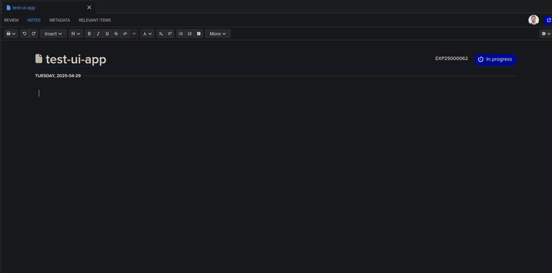
_The App features branching flows and will also validate user inputs._

**Appendices**:
* [Architecture Diagram](#architecture-diagram)

## Technical Prerequisites

This app is optimized as a minimal local development experience using [Docker](https://www.docker.com/) for reproducibility.

> ⚠️ **Development Only**: This example is not meant to be copied into production as-is. There are additional deployment, scale, and security concerns that should be addressed before deploying an app based on this example to production.

It relies on a few other tools that will be installed for you within Docker containers:
* [Cloudflare-tunnel](https://www.cloudflare.com/products/tunnel/) - expose a public webhook URL and forward the results locally. ⚠️ *Not for production or real data!*
* [Flask](https://flask.palletsprojects.com/) - A simple Python web application framework

## Getting Started

Create an empty placeholder file for Docker secrets. *nix example:

```bash
touch .client_secret
```

Windows example:

```cmd
echo.> .client_secret
```

Start Docker:

```bash
docker compose up --build -d
```

Tip: You can omit the `-d` option if you want to run in the foreground. Otherwise, use `docker compose logs -f` to tail logs.

> ℹ️ **Windows Note 1:** "Use ContainerD for pulling and storing images" may need to be enabled in `Docker > Settings > Features in development > Beta Features`

> ℹ️ **Windows Note 2**: If running into an error like "ERROR: request returned Bad Gateway for API route and version", [this solution](https://github.com/docker/for-mac/issues/6956#issuecomment-1876444658) may fix the problem.


You can verify that Flask is up and running:

```bash
curl localhost:8000/health
```

If Flask is running, you should see `OK` printed.

Be sure to note the URL created for you by `cloudflare-tunnel`. The log line should look something like this:

```
cloudflare-tunnel-1  | 2025-03-11T18:45:24Z INF +--------------------------------------------------------------------------------------------+
cloudflare-tunnel-1  | 2025-03-11T18:45:24Z INF |  Your quick Tunnel has been created! Visit it at (it may take some time to be reachable):  |
cloudflare-tunnel-1  | 2025-03-11T18:45:24Z INF |  https://pioneer-rights-hardly-disorder.trycloudflare.com                                  |
cloudflare-tunnel-1  | 2025-03-11T18:45:24Z INF +--------------------------------------------------------------------------------------------+
```

On *nix systems, you can easily obtain _just_ the URL via:

```
docker compose logs cloudflare-tunnel | grep -o 'https://[^ ]*trycloudflare.com[^ ]*' | tail -n 1
```

Example Output:

```
https://pioneer-rights-hardly-disorder.trycloudflare.com
```

> 💡 Don't forget to append `/1/webhooks`, making the full URL given to Benchling `https://pioneer-rights-hardly-disorder.trycloudflare.com/1/webhooks`

## Setting Up Your App in Benchling

### Benchling Prerequisites
1. Access to a Benchling tenant, like `https://my-tenant.benchling.com`
2. Ensure you've been granted access to the [Benchling Developer Platform Capability](https://help.benchling.com/hc/en-us/articles/9714802977805-Access-the-Benchling-Developer-Platform).
3. [Optional] If you'd like to render the App's UI in a Run, you'll need a [Benchling Connect](https://www.benchling.com/connect) license.
4. [Molecule entities](https://help.benchling.com/hc/en-us/articles/9684254682893-Molecule-entity-overview) will need to be enabled on your tenant.
5. [Global Apps](https://docs.benchling.com/docs/global-apps-faq) will need to be enabled on your tenant.

### Upload the App Manifest

Click the user icon in the bottom left corner to bring up the main menu. Select "Feature Settings" > "Developer Console"

Next, click the "Create app" button and choose "From manifest."

When prompted to upload a file, select `manifest.yaml` and click "Create."

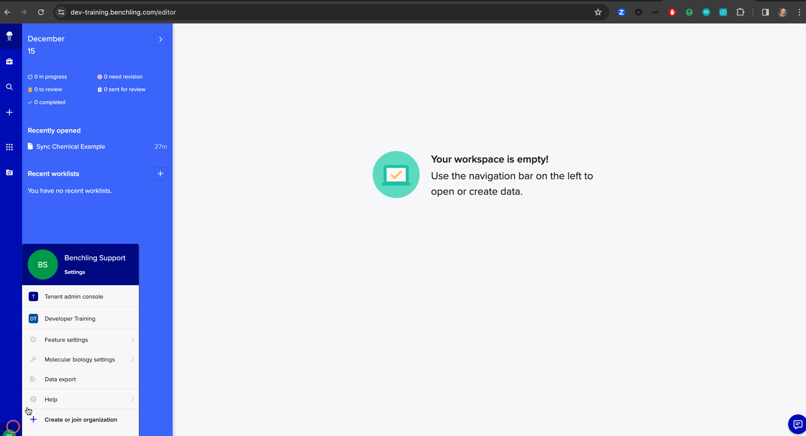

### Update the Webhook URL

Every time we restart the `cloudflare-tunnel` Docker container, it will provision
a new public webhook URL.

Update the Benchling App's Webhook URL in the UI with the new server and
append the path our Flask route expects (see `local_app/app.py`).

For example, if our `cloudflare-tunnel` generated URL is `https://pioneer-rights-hardly-disorder.trycloudflare.com`,
the webhook URL in Benchling should be:

```
https://https://pioneer-rights-hardly-disorder.trycloudflare.com/1/webhooks
```

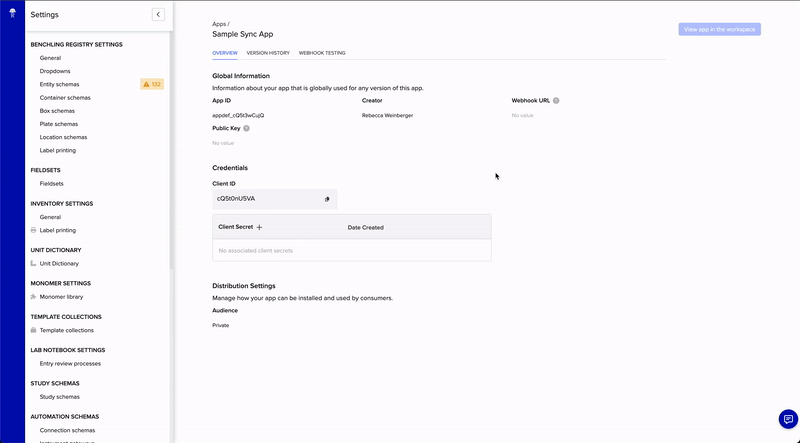

### Generating a Client Secret

Generate a client secret in Benchling and be sure to copy the secret.

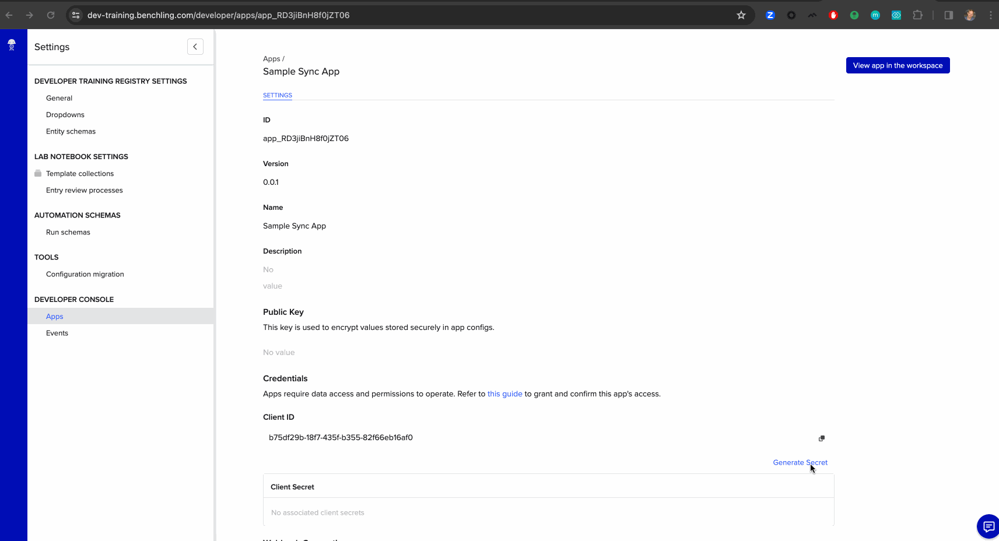

Since the client secret is sensitive, it's handled a bit differently. It's
registered as a `secret` in our `docker-compose.yaml` file, which will be looking
for a file `./client_secret`.

We can create this file and paste in the secret plaintext value if we have the secret in our clipboard.
On *nix:

```bash
touch .client_secret
pbpaste > .client_secret
```

> ⚠️ **Security Note:** Be sure to avoid committing `.client_secret` to a source code repository.

You'll then need to restart _just_ the `benchling-app` Docker service to pick up the changes:

```bash
docker-compose up -d
```

If you restart both containers, be sure to update your App in Benchling with the new webhook URL from cloudflare-tunnel.

### Setting Client ID

Our App needs a Client ID to pair with the Client Secret for authentication to Benchling. In this case, we've created our 
App to accept `CLIENT_ID` as an environment variable.

One easy way to set an environment variables for Docker is to add a `.env` file.

```bash
touch .env
```

Windows example:

```cmd
echo.> .env
```

Open it in an editor of your choice and set the values with the plaintext client ID 
for your App. For example:

```
CLIENT_ID=Ts7jtwPohM
```

### Setting App Definition ID

The App definition ID is available from the Developer Console by selecting the App to view.

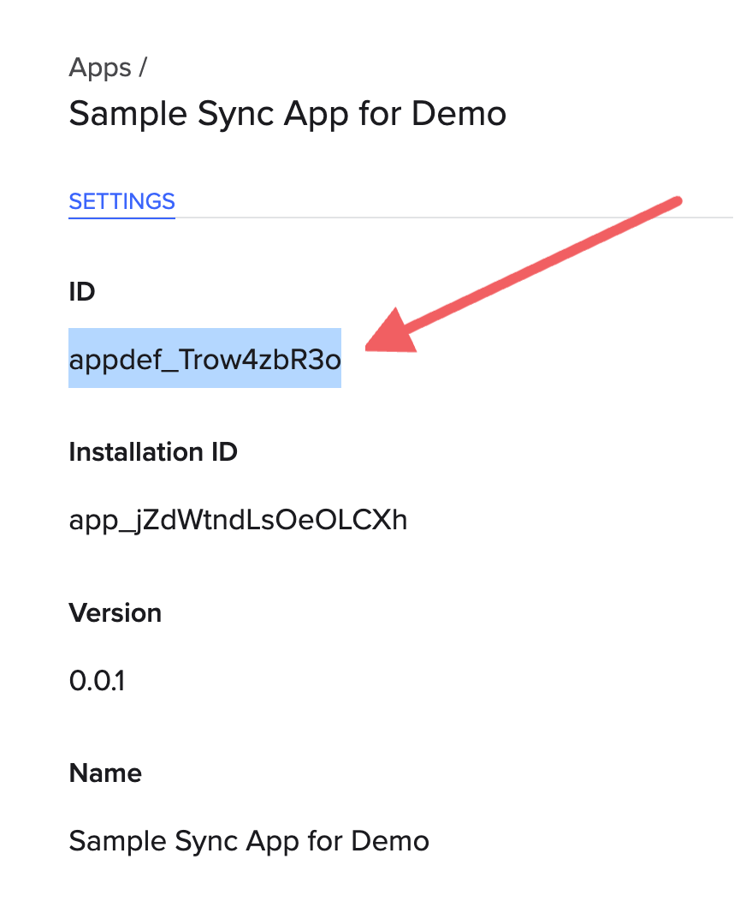

> ℹ️ **Note:** If you do NOT see this ID, please ensure [Global Apps](https://docs.benchling.com/docs/global-apps-faq) are enabled for your tenant.

Add it to your `.env` file with a variable name `APP_DEFINITION_ID`. The contents of your `.env` file should now look something like:

```
CLIENT_ID=Ts7jtwPohM
APP_DEFINITION_ID=appdef_Trow4zbR3o
```

### Restarting the Container to Reflect Environment Changes

Restart the `benchling-app` Docker container to pick up the environment changes.

```bash
docker-compose up -d
```

### Security Note: Storing App Secrets in Production

> ⚠️ **Security Note:** In production, store the secret with a secure solution such as a secrets store (AWS Secrets Manager, as an example) or, if storing programmatically, encrypted using app-layer encryption. Avoid placing it in plaintext anywhere in code or configuration.

### Create App Registry Dependencies

If you examine the `configuration` section of `manifest.yaml`, you'll see our App
expects a few configuration items:
1. A folder
2. A molecule entity schema with two decimal fields

We declare two `features` in the `manifest.yaml` so that our App can render
its UI as a `CANVAS` (e.g. within the Notebook) or on an `ASSAY_RUN`. If you'd like to use a Run, we'll also need:
1. An Lab Automation run schema

#### Folder

Create a new folder where the molecules created by the App will be placed.
An existing folder can also be used, if the App has permissions to it.


#### Molecule Entity Schema

Create the entity schema in the tenant's registry. If you do not have access to
the registry, you can ask your tenant administrator to do this for you.

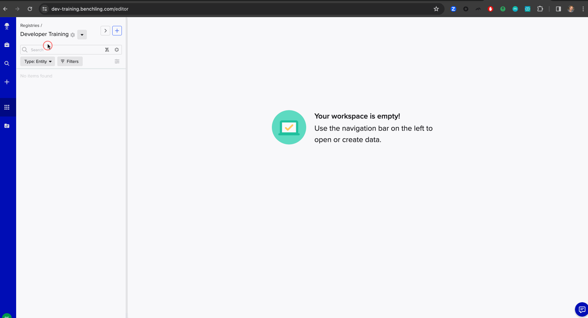

The created molecule schema should look something like this:

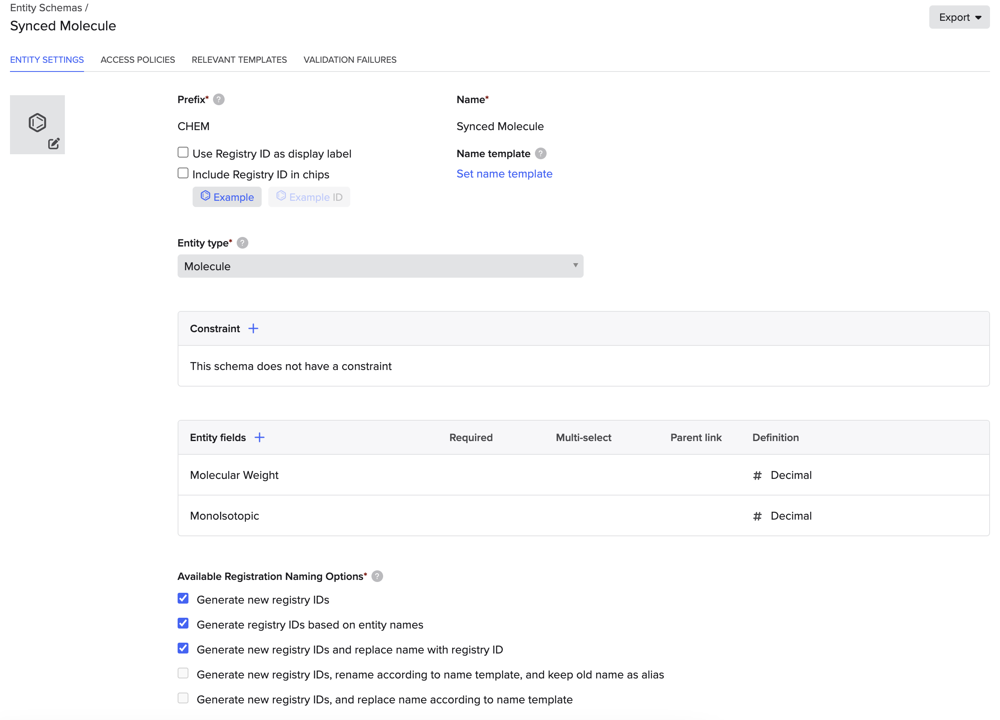

_Note: The names can be different, and the schema is allowed to have additional fields.
As long as it's for a `Molecule` entity, and has at least two `Decimal` fields._

#### [Optional] Lab Automation Run Schema

If using a Run, create a new lab automation run schema in the registry.

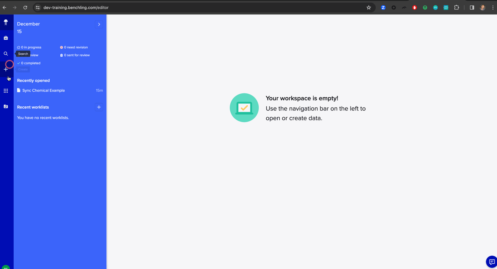

### Updating the App's Configuration

App Configuration gives us a stable code contract for referencing data mapped in a Benchling tenant.
The values of the data in Benchling can then be changed without updating App code.

Let's update our configuration to:
1. Specify a folder for syncing sequences
2. Link a molecule schema and fields for the synced chemicals
3. [Optional] If using a Run, select an assay run schema to associate with our Benchling App

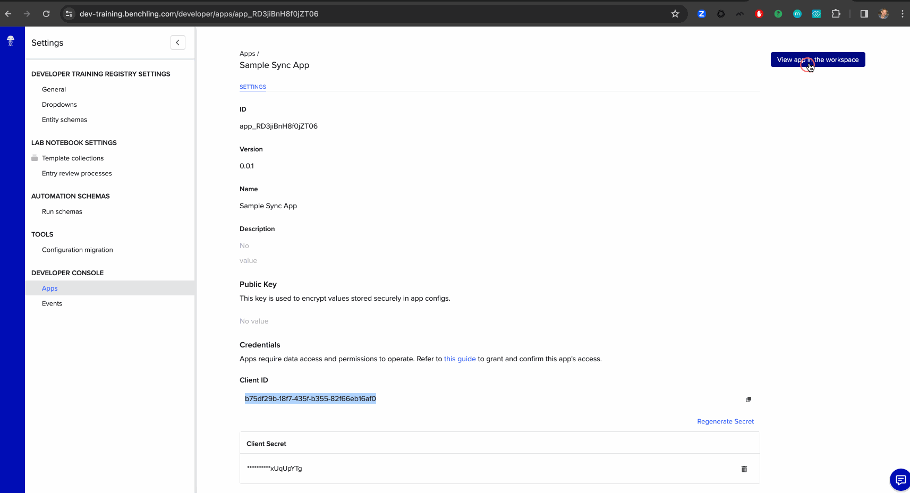

### Permission the App

By default, Benchling Apps do not have permission to any data in Benchling.
Let's grant some access by adding the Benchling App to an organization.


## Running the App - Syncing a Chemical

1. Create a new notebook entry
2. Insert a Canvas  
3. Enter a valid chemical name to search for, such as `acetaminophen`
4. Click "Search Chemicals"
5. After reviewing the preview, click "Create Molecule"
6. Click the linked entity to view it in Benchling


## [Optional] Running the App - via a Run

1. Insert a Run of the schema linked in App Config
2. Create the Run
3. Continue with steps 3-6 above

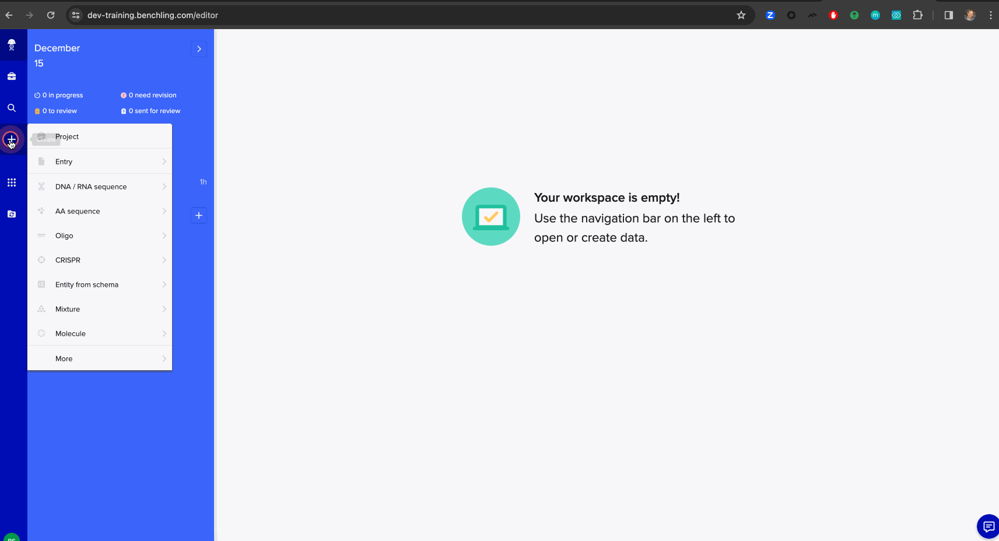

## Appendices

### Architecture Diagram

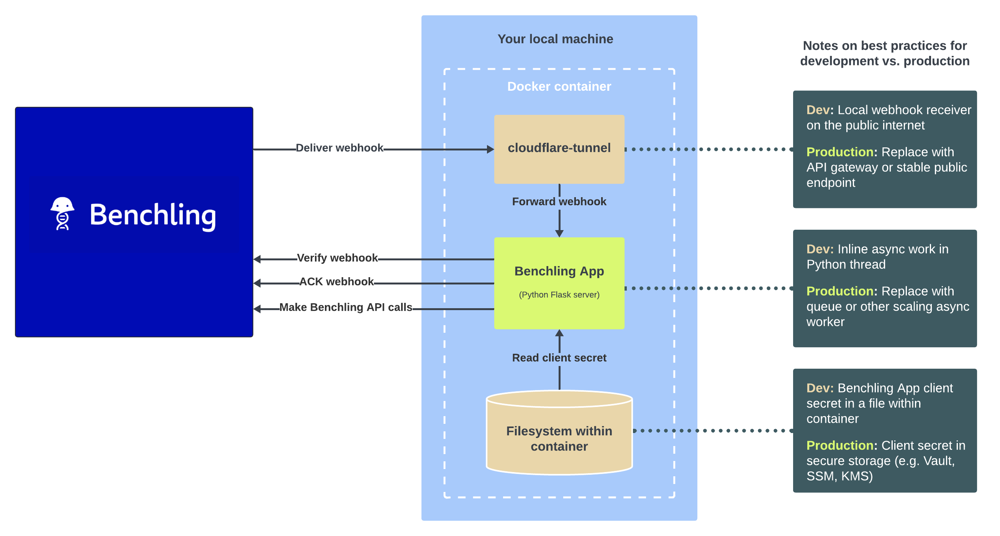